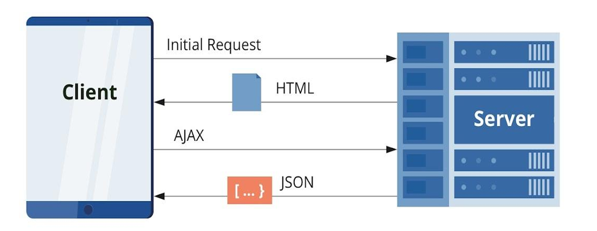

# What is React?

- React is a JavaScript library that focuses on declarative syntax and 
virtualization of DOM.
- It is an open-source library, developed by Facebook in 2013.
- It provides a declarative and efficient way to create interactive UI 
components.
- It allows building more reusable and maintainable UI components with ease.

# 🚀 React Project Setup Guide

## 📦 1. Using Create React App 

### 🛠 Steps:
```bash
npx create-react-app project-name
cd project-name
npm start 
```

## 📦 2. Using Vite

### 🛠 Steps:
```bash
npm create vite@latest project-name -- --template react
cd project-name
npm install
npm run dev
```

  
# Why React? SPA vs Traditional HTML
- Traditional Page Lifecycle

  Once the user accesses the page and performs any kind of action on that page, the page gets 
   reloaded with the changes that were done on the server-side.
  


- Single Page Application (SPA) Lifecycle

   Once the user accesses the page and performs any kind of action on that page, they get an 
  almost-instant reaction from the page (think of Facebook, when you comment on someone's post)
  

 # Virtual DOM & Rendering Flow
 - Initial Render: React builds a Virtual DOM (VDOM) tree to represent the UI in memory.
 - State Change: When state or props change, React creates a new VDOM tree.
 - Diffing Algorithm: React compares the new VDOM with the previous one to detect 
   changes.
 - Efficient Update: Only the changed parts of the real DOM are updated, improving 
   performance
# Virtual DOM & Rendering Flow
  


 # Props & PropTypes
## Props (Properties)
- Props are inputs to a React component.
- They allow data to flow from parent to child.
- Props are read-only and help make 
- components reusable.
- [Example](https://github.com/sudhanshusingh07/React/tree/main/props/src)
 ## PropTypes
- PropTypes help validate the type of props a component receives.
- Prevent bugs by catching incorrect or missing props.
- Makes it clear what props a component 
- expects — helpful for teams and during maintenance.

 #Hooks
 - Hooks are functions that let you “hook into” React state and lifecycle features from function components.
 - Simplifies stateful logic sharing across components.
 - Enables cleaner, reusable, and more testable code.
 - Eliminates need for this, constructor, and class-based syntax.
 - Only call Hooks at the top level of the component.
 - Only call Hooks from React functions (components or custom hooks).
 - Examples - useState, useEffect, useContext, useRef, useMemo, useCallback etc.


 ## useState
    - useState is a React Hook that lets you add a state variable to your component.
    - Syntex
      const [state, setState] = useState(initialState)


## useEffect
   The useEffect Hook allows you to perform side effects in your components.
   Some examples of side effects are: fetching data, directly updating the DOM, and timers.
   useEffect accepts two arguments. The second argument is optional.
   useEffect(<function>, <dependency>)


## useContext
   React Context is a way to manage state globally.
   It can be used together with the useState Hook to share state between deeply nested components more easily than with useState alone.


